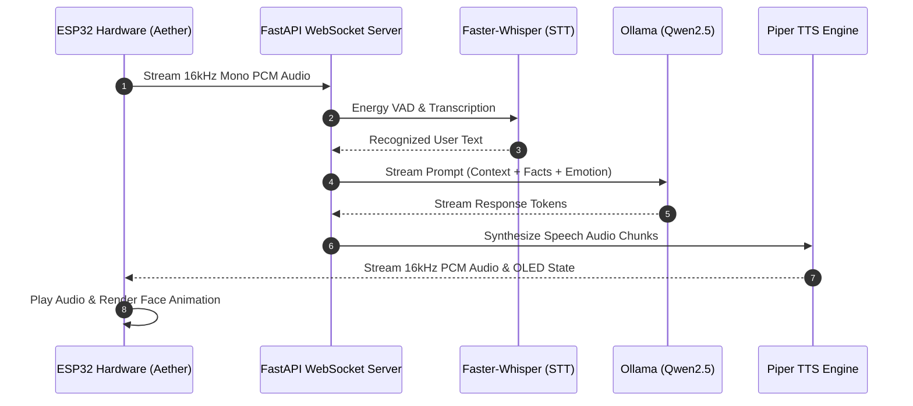

# Aether — Offline AI Voice Assistant

[](https.python.org)
[](https://fastapi.tiangolo.com)
[](#hardware--pinout-configuration)
[](#system-architecture)

**Aether** is an ultra-low latency, fully offline, privacy-first AI voice assistant. It pairs a custom ESP32 hardware device (equipped with an I2S microphone, MAX98357A audio amplifier, and SSD1306 OLED face display) with an intelligent Python backend. 

Aether streams voice back and forth over full-duplex WebSockets, performing real-time speech recognition via `faster-whisper`, natural conversation processing via a local Ollama LLM (`Qwen 2.5`), dynamic emotion and personality tracking, and speech synthesis using `Piper TTS` (supporting English and Malayalam).

---

## Key Features

- **100% Local & Privacy-Preserving**: No cloud dependencies or external API keys. All audio processing and intelligence remain on your local machine.
- **Full-Duplex Streaming Pipeline**: Low-latency bi-directional WebSocket streaming between ESP32 and server.
- **Auto-Discovery via mDNS**: The ESP32 discovers the server on the LAN automatically at `aether.local` without hardcoded IP addresses.
- **Bilingual Intelligence**: Supports seamless speech recognition and speech synthesis for both **English** and **Malayalam**.
- **Dynamic Persona & Emotion Engine**: Maintains conversation history, user fact memory, emotional context tracking, and evolving personality traits.
- **Visual Expression**: ESP32 animated OLED screen displays real-time expressions (idle, listening, thinking, speaking, happy, sad).
- **Wi-Fi Provisioning Portal**: First-boot AP setup portal (`AetherSetup`) powered by `WiFiManager` with persistent NVS memory storage.

---

## System Architecture



---

## Project Structure

```text
.
├── firmware/                   # ESP32 Arduino firmware and header modules
│   ├── firmware.ino            # Main sketch, state machine, and RTOS tasks
│   ├── AudioPlayback.h         # Double-buffered I2S speaker DMA engine
│   ├── AudioRecorder.h         # I2S microphone DMA audio capture
│   ├── Config.h                # Hardware pinouts, mDNS host, and parameters
│   ├── Declarations.h          # Global variable & state extern declarations
│   ├── Face.h                  # Animated OLED face renderer (Adafruit GFX)
│   ├── ServerComm.h            # Full-duplex WebSocket client protocol
│   └── WiFiHelper.h            # WiFiManager captive portal & mDNS discovery
├── models/                     # Offline AI model assets
│   └── piper/                  # Piper ONNX voice models and JSON configs
│       ├── en_US-hfc_female-medium.onnx
│       ├── en_US-hfc_female-medium.onnx.json
│       ├── ml_IN-meera-medium.onnx
│       └── ml_IN-meera-medium.onnx.json
├── services/                   # Modular Python backend services
│   ├── ai_brain.py             # LLM context builder & Ollama client
│   ├── emotion_engine.py      # Sentiment & emotional context analyzer
│   ├── memory_store.py         # SQLite persistence for sessions & user facts
│   ├── personality_engine.py  # Dynamic personality evolution tracker
│   ├── pipeline.py             # Voice pipeline controller & VAD guard
│   ├── speech_to_text.py       # Faster-Whisper STT engine & hallucination guards
│   ├── tts_service.py          # Piper TTS engine (English & Malayalam)
│   └── user_learner.py         # Background user fact extractor
├── app_fastapi.py              # FastAPI server entry point with mDNS server
├── config.py                   # Central server configuration & tuning
├── requirements.txt            # Python dependencies
├── assistant_memory.db         # Persistent SQLite database (auto-created)
└── README.md                   # Project documentation
```

---

## Hardware & Pinout Configuration

| Component | Pin Function | ESP32 GPIO Pin |
| :--- | :--- | :--- |
| **INMP441 Microphone** | WS (Word Select) | `GPIO 32` |
| | SD (Data Out) | `GPIO 34` |
| | SCK (Bit Clock) | `GPIO 33` |
| | L/R (Channel) | GND (Left Channel) |
| **MAX98357A Audio Amp** | DIN (Data In) | `GPIO 25` |
| | BCLK (Bit Clock) | `GPIO 4` |
| | LRC (Word Select) | `GPIO 2` |
| **SSD1306 OLED (128x64)**| SDA | `GPIO 26` |
| | SCL | `GPIO 27` |
| **Control Button** | Push Button | `GPIO 14` (Internal Pull-Up) |

---

## Prerequisites

- **Python 3.10+**
- **Ollama** installed and running locally ([ollama.com](https://ollama.com))
- **Arduino IDE** or **PlatformIO** with ESP32 board support (v2.x or v3.x)
- Required Arduino Libraries:
  - `WiFiManager` by tzapu
  - `WebSockets` by Markus Sattler
  - `Adafruit SSD1306` & `Adafruit GFX Library`
  - `ArduinoJson` (v6 or v7)

---

## Quick Start Guide

### 1. Backend Setup

Clone the repository and set up a Python virtual environment:

```bash
# Create virtual environment
python -m venv .venv

# Activate on Windows
.venv\Scripts\activate

# Install dependencies
pip install -r requirements.txt
```

### 2. Model Setup

#### LLM Setup (Ollama)
Ensure Ollama is running, then pull the recommended model:
```bash
ollama pull qwen2.5:3b
```

#### TTS Voice Models (Piper)
Place the Piper ONNX voice files inside `models/piper/`:
- `en_US-hfc_female-medium.onnx`
- `en_US-hfc_female-medium.onnx.json`
- `ml_IN-meera-medium.onnx`
- `ml_IN-meera-medium.onnx.json`

### 3. Running the Server

Start the FastAPI backend:

```bash
python app_fastapi.py
```

The server will initialize models, start the WebSocket endpoint at `/voice_stream`, and broadcast its mDNS address (`aether.local:5000`).

---

## Firmware Flashing

1. Open `firmware/firmware.ino` in the Arduino IDE.
2. Select target board: **ESP32 Dev Module**.
3. Flash the code to your ESP32 board.
4. **First Boot Provisioning**:
   - The device will create a Wi-Fi Access Point named **`AetherSetup`** (Password: `aether1234`).
   - Connect your phone or PC to `AetherSetup` and open the captive portal.
   - Enter your home Wi-Fi credentials and save. The device will connect and register `aether.local`.

---

## Configuration (`config.py`)

You can customize operational settings in `config.py` or via environment variables:

| Parameter | Default | Description |
| :--- | :--- | :--- |
| `HOST` | `0.0.0.0` | Server bind host address |
| `PORT` | `5000` | Server HTTP/WebSocket port |
| `WHISPER_MODEL_SIZE` | `tiny` | Faster-Whisper model size (`tiny`, `base`, `small`) |
| `WHISPER_DEVICE` | `cpu` | Inference device (`cpu` or `cuda`) |
| `OLLAMA_MODEL` | `qwen2.5:3b` | Target LLM model name |
| `MAX_REPLY_WORDS` | `28` | Maximum length of spoken assistant response |
| `MAX_REPLY_SENTENCES`| `2` | Maximum sentences per speech response |

---

## License

Distributed under the MIT License. See `LICENSE` for more information.
